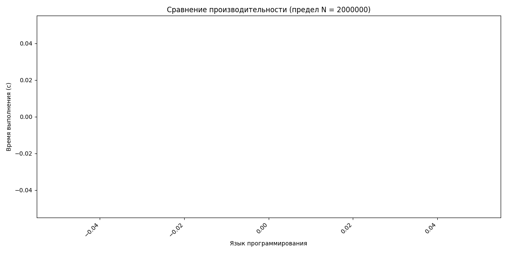
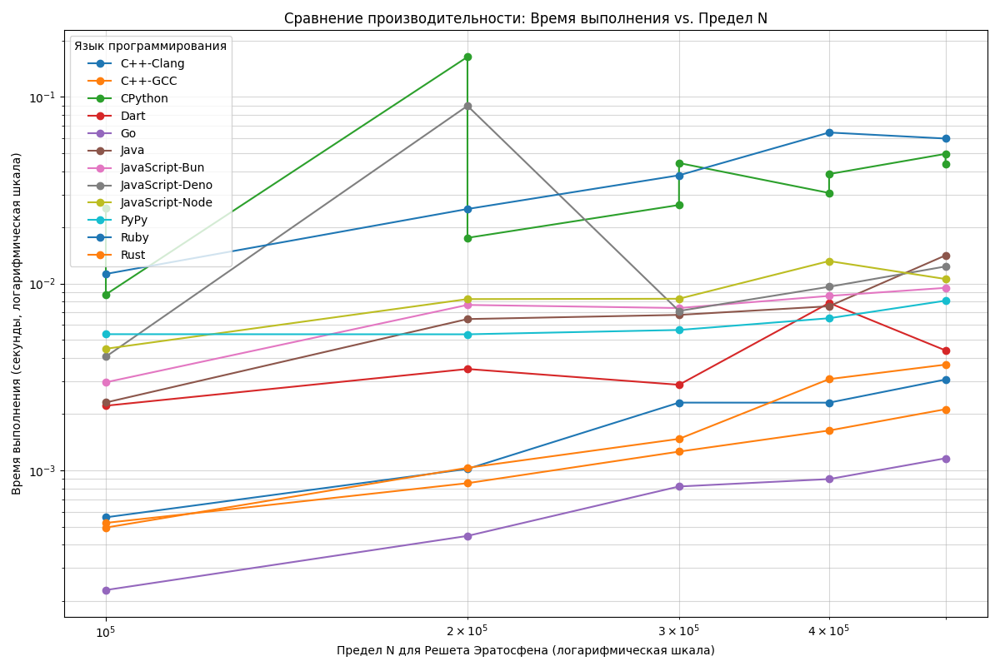

# Сравнение производительности языков программирования

Этот проект содержит шаблоны для измерения скорости работы различных языков программирования на примере вычисления 40-го числа Фибоначчи итеративным способом. Для каждого языка используется Docker-контейнер для обеспечения одинаковых условий выполнения.

## Структура проекта

Каждый язык имеет свою директорию, содержащую:
- Исходный код (`<language_name>_fib.<ext>`)
- `Dockerfile` для сборки и запуска теста

## Языки

- Python (`python/`)
- JavaScript (Node.js) (`javascript/`)
- Java (`java/`)
- C++ (`cpp/`)
- Go (`go/`)
- Rust (`rust/`)

## Инструкции по запуску

Для каждого языка:

1.  Перейдите в директорию языка:
    ```bash
    cd <language_name>
    ```

2.  Соберите Docker-образ:
    ```bash
    docker build -t <language_name>-fib-test .
    ```
    (например, `docker build -t python-fib-test .` для Python)

3.  Запустите контейнер для выполнения теста:
    ```bash
    docker run --rm <language_name>-fib-test
    ```
    (например, `docker run --rm python-fib-test`)

Контейнер выведет вычисленное число Фибоначчи и время, затраченное на вычисление.

## Задача

Вычисляются все простые числа от 2 до предела на разных языках программирования

## Сравнение производительности (Решето Эратосфена)

Ниже приведен график зависимости времени выполнения от предела N для разных языков:



Ниже приведен график зависимости времени выполнения от предела N для разных языков:


Ниже приведен график зависимости времени выполнения от предела N для разных языков:


Ниже приведен график зависимости времени выполнения от предела N для разных языков:


Ниже приведен график зависимости времени выполнения от предела N для разных языков:

