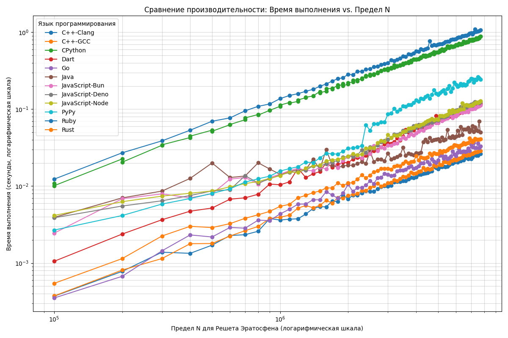

# Сравнение производительности реализаций Решета Эратосфена

Этот проект содержит реализации алгоритма "Решето Эратосфена" на различных языках программирования и инструменты для тестирования их производительности. Производительность измеряется для разных верхних пределов N.

Результаты сравнения визуализируются и отображаются в этом README.


## Как запустить тесты локально

1.  **Убедитесь, что у вас установлен Docker.**
    Все тесты производительности запускаются в Docker-контейнерах для изоляции и консистентности окружения.

2.  **Установите зависимости для скрипта генерации отчета (Python):**
    ```bash
    pip install -r report/requirements.txt
    ```

3.  **Запустите основной скрипт тестирования:**
    Этот скрипт последовательно запустит тесты для всех языков с различными пределами N.
    ```bash
    python3 report/run_tests.py
    ```
    Это может занять некоторое время. В процессе будут созданы JSON файлы с результатами в директории `report/`.

4.  **Сгенерируйте отчет и обновите график:**
    После завершения `run_tests.py`, запустите скрипт генерации отчета:
    ```bash
    python3 report/generate_report.py
    ```
    Этот скрипт обработает JSON файлы, сгенерирует новый график `report/performance_over_limits_chart.png` и обновит соответствующий раздел в этом `README.md`. Файлы `test_results-*.json` будут удалены после генерации отчета.


## Сравнение производительности (Решето Эратосфена)

Ниже приведен график зависимости времени выполнения от предела N для разных языков:



Ниже приведен график зависимости времени выполнения от предела N для разных языков:


Ниже приведен график зависимости времени выполнения от предела N для разных языков:


Ниже приведен график зависимости времени выполнения от предела N для разных языков:


Ниже приведен график зависимости времени выполнения от предела N для разных языков:


Ниже приведен график зависимости времени выполнения от предела N для разных языков:


Ниже приведен график зависимости времени выполнения от предела N для разных языков:


| Ранг | Язык | Время (с) |
|------|------|-----------|
| 1 | Rust | 0.000005167 |
| 2 | Dart | 0.000007000 |
| 3 | Go | 0.000012583 |
| 4 | C++-GCC | 0.000015833 |
| 5 | C++-Clang | 0.000042208 |
| 6 | CPython | 0.000055458 |
| 7 | CPython | 0.000068208 |
| 8 | JavaScript-Deno | 0.000079458 |
| 9 | Ruby | 0.000087000 |
| 10 | Java | 9.9e-05 |
| 11 | JavaScript-Node | 0.000299375 |
| 12 | JavaScript-Bun | 0.000327417 |
| 13 | PyPy | 0.000477208 |


## Автоматическое обновление

Этот репозиторий настроен с использованием GitHub Actions для автоматического запуска тестов производительности и обновления графика в этом README.md каждую неделю. Процесс также можно запустить вручную через вкладку "Actions" в GitHub.

Изменения (обновленный `README.md` и `report/performance_over_limits_chart.png`) автоматически коммитятся в репозиторий.

График зависимости скорости (число простых/сек) от предела N для разных языков:


График зависимости скорости (число простых/сек) от предела N для разных языков:


График зависимости скорости (число простых/сек) от предела N для разных языков:


График зависимости скорости (число простых/сек) от предела N для разных языков:


